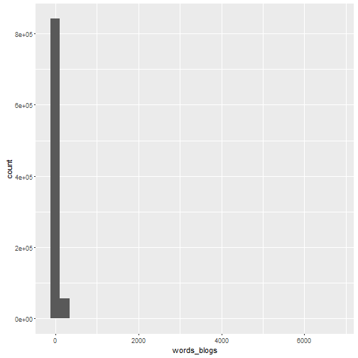
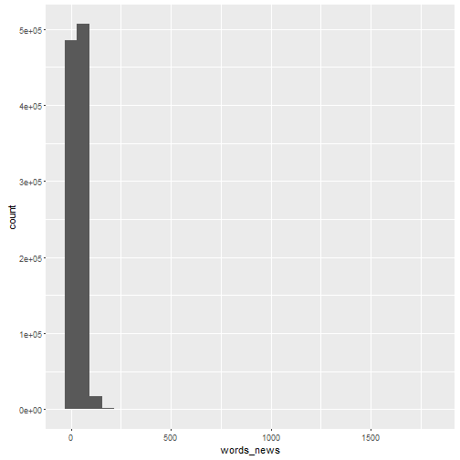
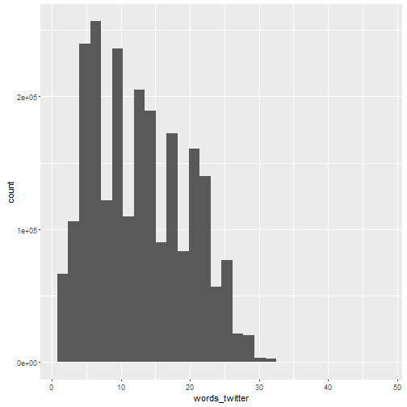

## Abstract
This report presents the basic summary statistics of the three data sets downloaded from 
<a href="https://d396qusza40orc.cloudfront.net/dsscapstone/dataset/Coursera-SwiftKey.zip">Coursera-SwiftKey.zip</a> .
It also reports interesting finding that I have found so far and provide feedback on the plans for creating a prediction algorithm via a shiny application.

## Introduction
We look at the three data sets of US English text from a corpus called HC Corpora. The three data sets are : a set of internet blogs posts, a set of internet news articles, and a set of twitter messages.

For the English language, there are three files we have to deal with:

    en_US.blogs.txt
    en_US.news.txt
    en_US.twitter.txt


Following information are collected from the data sets
* File Size
* Number of Lines
* Number of Non-Empty Lines
* Number of Words
* Distribution of Words (Quantiles and Plot)
* Number of Characters
* Number of non-white Characters

In the following section we will describe the data collection process, the section after that gives the results of the data exploration, we finally present conclusions and give references.

For our analysis we use the R computing environment, as well as the libraries stringi and ggplot2 . In order to make the code more readable we use the pipe operator from the magrittr library . This report is compiled using the rmarkdown library . Finally during writing we used the RStudio IDE .

Data
The data is presented as a ZIP compressed archive, which is freely downloadable from https<a href="https://d396qusza40orc.cloudfront.net/dsscapstone/dataset/Coursera-SwiftKey.zip">Coursera-SwiftKey.zip</a> .


```r
# specify the source and destination of the download
destination_file <- "Coursera-SwiftKey.zip"

# extract the files from the zip file
unzip(destination_file)
```

Inspect the unzipped files

```r
# find out which files where unzipped
unzip(destination_file, list = TRUE )
```

```
##                             Name    Length                Date
## 1                         final/         0 2014-07-22 10:10:00
## 2                   final/de_DE/         0 2014-07-22 10:10:00
## 3  final/de_DE/de_DE.twitter.txt  75578341 2014-07-22 10:11:00
## 4    final/de_DE/de_DE.blogs.txt  85459666 2014-07-22 10:11:00
## 5     final/de_DE/de_DE.news.txt  95591959 2014-07-22 10:11:00
## 6                   final/ru_RU/         0 2014-07-22 10:10:00
## 7    final/ru_RU/ru_RU.blogs.txt 116855835 2014-07-22 10:12:00
## 8     final/ru_RU/ru_RU.news.txt 118996424 2014-07-22 10:12:00
## 9  final/ru_RU/ru_RU.twitter.txt 105182346 2014-07-22 10:12:00
## 10                  final/en_US/         0 2014-07-22 10:10:00
## 11 final/en_US/en_US.twitter.txt 167105338 2014-07-22 10:12:00
## 12    final/en_US/en_US.news.txt 205811889 2014-07-22 10:13:00
## 13   final/en_US/en_US.blogs.txt 210160014 2014-07-22 10:13:00
## 14                  final/fi_FI/         0 2014-07-22 10:10:00
## 15    final/fi_FI/fi_FI.news.txt  94234350 2014-07-22 10:11:00
## 16   final/fi_FI/fi_FI.blogs.txt 108503595 2014-07-22 10:12:00
## 17 final/fi_FI/fi_FI.twitter.txt  25331142 2014-07-22 10:10:00
```


```r
# inspect the data
list.files("final")
```

```
## [1] "de_DE" "en_US" "fi_FI" "ru_RU"
```


```r
list.files("final/en_US")
```

```
## [1] "en_US.blogs.txt"   "en_US.news.txt"    "en_US.twitter.txt"
```

The corpora are contained in three separate plain-text files, out of which one is binary, for more information on this see . We import these files as follows.


```r
# import the blogs and twitter datasets in text mode
blogs <- readLines("final/en_US/en_US.blogs.txt", encoding="UTF-8")
twitter <- readLines("final/en_US/en_US.twitter.txt", encoding="UTF-8")
con <- file("final/en_US/en_US.news.txt", open="rb")
news <- readLines(con, encoding="UTF-8")
close(con)
rm(con)
```

## Basic Statistics

The before we analyse the files we look at their size (presented in MegaBytes / MBs).


```r
# file size (in MegaBytes/MB)
file.info("final/en_US/en_US.blogs.txt")$size   / 1024^2
```

```
## [1] 200.4242
```

```r
file.info("final/en_US/en_US.news.txt")$size    / 1024^2
```

```
## [1] 196.2775
```

```r
file.info("final/en_US/en_US.twitter.txt")$size / 1024^2
```

```
## [1] 159.3641
```

For our analysis we need two libraries.


```r
# library for character string analysis
library(stringi)

# library for plotting
library(ggplot2)
```

We analyse lines and characters.

```r
stri_stats_general(blogs)
```

```
##       Lines LinesNEmpty       Chars CharsNWhite 
##      899288      899288   206824382   170389539
```

```r
stri_stats_general(news)
```

```
##       Lines LinesNEmpty       Chars CharsNWhite 
##     1010242     1010242   203223154   169860866
```

```r
stri_stats_general(twitter)
```

```
##       Lines LinesNEmpty       Chars CharsNWhite 
##     2360148     2360148   162096031   134082634
```

Next we count the words per item (line). We summarise the distribution of these counts per corpus, using summary statistics and a distribution plot. we start with the blogs' corpus.


```r
words_blogs   <- stri_count_words(blogs)
summary( words_blogs )
```

```
##    Min. 1st Qu.  Median    Mean 3rd Qu.    Max. 
##    0.00    9.00   28.00   41.75   60.00 6726.00
```

```r
qplot(words_blogs)
```

```
## `stat_bin()` using `bins = 30`. Pick better value with `binwidth`.
```




Next we analyse the news corpus.


```r
words_news    <- stri_count_words(news)
summary(words_news)
```

```
##    Min. 1st Qu.  Median    Mean 3rd Qu.    Max. 
##    1.00   19.00   32.00   34.41   46.00 1796.00
```

```r
qplot(words_news)
```

```
## `stat_bin()` using `bins = 30`. Pick better value with `binwidth`.
```



Finally we analyse the twitter corpus.

```r
words_twitter <- stri_count_words(twitter)
summary(words_twitter)
```

```
##    Min. 1st Qu.  Median    Mean 3rd Qu.    Max. 
##    1.00    7.00   12.00   12.75   18.00   47.00
```

```r
qplot(words_twitter)
```

```
## `stat_bin()` using `bins = 30`. Pick better value with `binwidth`.
```



### Conclusions
1. We analysed the three datasets of corpora of US English text. The file sizes are around 200 MegaBytes (MBs) per file.
2. We find that the __blogs__ and __news__ corpora consist of about 1 million items each, and the __twitter__ corpus consist of over 2 million items. 
3. Twitter messages have a character limit of 140 (with exceptions for links), this explains why there are some many more items for a corpus of about the same size.
4. This result is further supported by the fact that the number of characters is similar for all three corpora (around 200 million each). 
5. Finally we find that the frequency distributions of the blogs and news corpora are similar (appearing to be log-normal). The frequency distribution of the twitter corpus is again different, as a result of the character limit.
